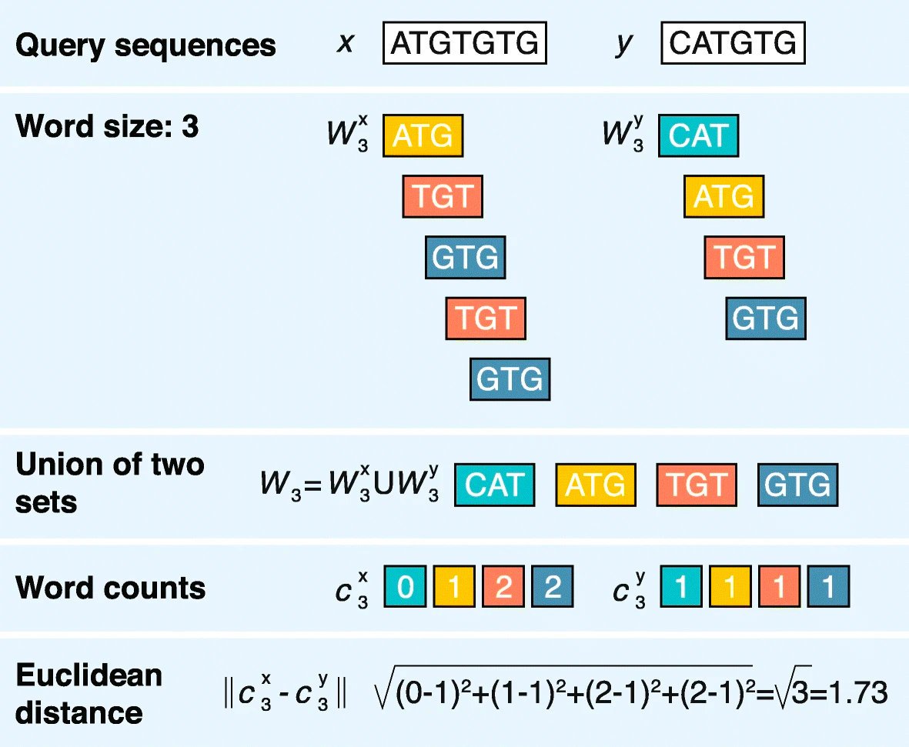

```{r, include = FALSE}
library(knitr)
knitr::opts_chunk$set(
  collapse = TRUE,
  comment = "#>"
)
```

## Introduction

`alfa` is an R package for alignment-free analysis using different metrics and phylogeny reconstruction using alignment-free methods. Alignment-free methods refer to methods of comparing similarity/dissimilarity of sequences without explicitly aligning them.

```{r setup}
require("devtools")
install_github("gaojunxuan/alfa", build_vignettes = TRUE)
library(alfa)
```

## Methods and Theory

Most alignment-free methods rely on k-mer counting. A k-mer of a sequence is a continuous substring of length k. Given a string of length \$n\$, there are $n-k+1$ k-mers. For each sequence, we collect all the k-mers to form a k-mer counting vector. Then, we compare the vectors using different distance measures, which allows us to indirectly compare the sequences without explicitly aligning them.

To get all k-mers of a given string, we call:

```{r}
sampleSeq <- "ATGATGGATGCTGG"
alfa::allKMers(sampleSeq, 3)
```

This returns a vector containing all 3-mers of `sampleSeq`. For DNA sequence, we usually choose a value of $k$ between 8-14. For phylogenetic analyses specifically, we usually choose $k$ to be between 9 and 14. These recommended values are due to Zielezinski et al.

### Euclidean Distance

The Euclidean metric measures the dissimilarity of two sequences by computing the Euclidean distance between two word-frequency vectors.



In our package, this can be calculated as follows

```{r}
seq1 <- "ATGTGTG"
seq2 <- "CATGTG"
alfa::euclideanDistance(seq1, seq2, 3)
```

### Standardized Euclidean Distance

One disadvantage of the Euclidean metric is that it does not account for the variance among the k-mers. This can be corrected using a so-called standardized Euclidean metric. This metric is first proposed by Wu, Burke, and Davison. It utilizes a concept known as the overlap capability. The ability of a given k-mer is an indicator of the distribution of the k-mer. For more mathematical background on this method, see *The distribution of the frequency of occurrence of nucleotide subsequences, based on their overlap capability* by Gentleman and Mullin.

The standardized Euclidean distance is implemented in our package and can be called similar to the Euclidean distance.

```{r}
seq1 <- "ATGTGTG"
seq2 <- "CATGTG"
alfa::standardizedEuclidean(seq1, seq2, 3)
```

### Limpel-Ziv Compression Distance

Unlike the previous two metrics, which both utilize the frequency of k-mers, the compression distance takes an information theoretic approach. Limpel-Ziv complexity in particular, measures the compressibility of a given string. It can then be converted into a compression distance measure that measure the differences of sequences at a global scale.

## Visualizing Pairwise Distance

We can visualize pairwise distance as follows. In the following example, we will use the `woodmouse` data set from the package `ape`.

```{r}
library("ape")
data("woodmouse")
woodmouse <- as.list(woodmouse)
woodmouse <- lapply(woodmouse, ape::as.character.DNAbin)
woodmouse <- lapply(woodmouse, paste0, collapse = "")
woodmouseSet <- Biostrings::DNAStringSet(unlist(woodmouse))

plotPairwiseDist(woodmouseSet, metric = "euclidean")
```

This generates a heatmap that illustrates the pairwise distance. Additional arguments can be passed into the `plotPairwiseDist` function to customize the look of the heatmap.

## Phylogeny Reconstruction and Evaluation

This package provides wrapper functions for constructing and visualizing phylogenetic trees using results from an alignment-free analysis. Once we have a pairwise distance matrix, we can construct a phylogenetic tree using either the neighbor-joining algorihtm (preferred) or the UPGMA algorithm.

```{r}
woodmouseDistMat <- createDistanceMatrix(woodmouseSet, metric = "euclidean")
njtree <- neighborJoiningTree(woodmouseDistMat)
```

To see how well a phylogenetic tree actually reflects the evolution distance of every pair of genes, we can plot the distance on the tree against the pairwise distance as follows.

```{r}
plotDistanceCorrelation(woodmouseDistMat, njtree)
```

Note that although in this example we used the phylogenetic tree constructed from the matrix, the second parameter can be any phylogenetic tree. It can be a phylogenetic tree constructed using character-based and alignment-based methods. Doing so helps us better evaluate the power and limitations of alignment-free methods and different metrics.
